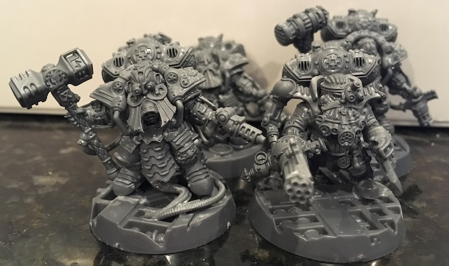
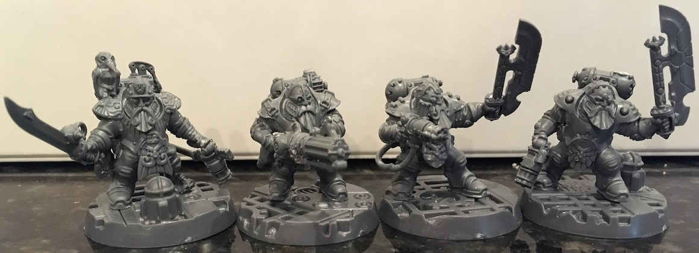

*This Odd Canon rules document is completely unofficial and in no way endorsed by Games Workshop Limited. It contains suggested rules for using additional Games Workshop miniatures with the 2018 edition of the Kill Team game.*

---

# DEMIURG

**The Demiurg are squat humanoids of unknown origin. Their civilization is organized into nomadic Brotherhoods. They are allies of the T’au. Some Demiurg Brotherhoods have become full members of the T’au Empire. Brotherhood Troopers and Hearthguard protect the mining, manufacturing, and trade interests of the Demiurg.**

The Demiurg have no known home world, although there are many theories regarding their origin. The various Demiurg Brotherhoods inhabit enormous mining and manufacturing vessels that make the Demiurg a trading power on the Eastern Fringe of the galaxy. Most of the races that encounter the Demiurg establish trade relationships with them, trading for everything from complex machinery to metal-rich asteroids.

Much of Demiurg technology has developed in support of deep-space mining and manufacturing. That includes the ability to defend their vessels and resources. It is thought, for example, that T'au ion weaponry was shared with them by Demiurg trading partners.

Demiurg defense forces favor close-in weaponry useful in defending against boarding actions or fighting in mines or cramped factory spaces. Their elite Hearthguard units are known for using exo armour that is almost the match for the power armour worn by Space Marines.

| D6 | BACKGROUND: BROTHERHOOD |
| :---: | :--- |
| **1** | **Strongholders:** This kill team includes members from a Stronghold-class commerce and manufacturing vessel and may include members from more than one Brotherhood. |
| **2** | **Bastion Brotherhood:** This kill team includes members from a Bastion-class mining and manufacturing vessel who are all part of the same Brotherhood. |
| **3** | **Asteroid Movers:** This kill team comprises members of the "crew" of an asteroid that the Demiurg have claimed for mining and are transporting to a buyer. |
| **4** | **Expedition:** This kill team is on an expedition for a Demiurg League Warlord. An expeditions is "the continuation of business by other means." |
| **5** | **Guildsmen:** This kill team is under the, perhaps temporary, jurisdiction of the Engineering Guild. |
| **6** | **T'au Empire:** This kill team comprises members who are or were part of a wider T'au force. |

| D6 | MISSION: PROFIT|
| :---: | :--- |
| **1** | **Staking a Claim:** This kill team is claiming previously discovered resources for their Brotherhood to exploit. |
| **2** | **Trading:** Demiurg society depends on trading raw materials and manufactured goods with other civilizations. The kill team will fight through great resistance to open negotiations with new tradking partners. |
| **3** | **Survey:** The Brotherhood requires raw material to mine and to commit to manufacturing. The area must be surveyed for potential new claims. |
| **4** | **Repair:** Mining and manufacturing require significant automation. With this much machinery, there is always something that must be repaired. |
| **5** | **Technology Recovery:** The Demiurg are constantly on the lookout for new technology to copy and exploit. Anywhere there has been conlict is a good site to retrieve technology from other civilizations. |
| **6** | **For the Greater Good:** Roll on the T'au Empire **Mission: Service to the Greater Good** table. |

| D6 | SQUAD QUIRK: TEMPERAMENT |
| :---: | :--- |
| **1** | **Irascible:** Even the most minor of insults is enough for this kill team to draw weapons. Don't call them "squats". |
| **2** | **Short-tempered:** The members of this kill team will ignore minor slights, but can turn angry in an instant. |
| **3** | **Doughty:** The members of this kill team will stand their ground even in the face of heavy fire or overwhelming odds. |
| **4** | **Tenacious:** Nothing will prevent this kill team from accomplishing their mission. |
| **5** | **Greedy:**  |
| **6** | **Inebriated:** As humans say, "I don't know much about squats, but they can hold their liquor, until they can't." |

| D10 | SPEACIALISTS' DEMEANORS |
| :---: | :--- |
| **1** | **:**  |
| **2** | **:**  |
| **3** | **:**  |
| **4** | **:**  |
| **5** | **:**  |
| **6** | **:**  |
| **7** | **:**  |
| **8** | **:**  |
| **9** | **:**  |
| **10** | **:**  |

## DEMIURG KILL TEAMS

**If every model in your kill team has the *Demiurg* Faction keyword, you can use Demiurg Tactics.**

| TACTIC | |
| :--- | ---:
| **Demiurg Tactic**   Description | |
| | 1 CP |

| TACTIC | |
| :--- | ---:
| **Demiurg Tactic**   Description | |
| | 1 CP |

| TACTIC | |
| :--- | ---:
| **Demiurg Tactic**   Description | |
| | 1 CP |

| TACTIC | |
| :--- | ---:
| **Demiurg Tactic**   Description | |
| | 1 CP |

<table>
    <tr>
        <th colspan="12">BROTHERHOOD TROOPER</th>
    </tr>
    <tr style="font-weight:bold">
        <td>NAME</td>
        <td>M</td>
        <td>WS</td>
        <td>BS</td>
        <td>S</td>
        <td>T</td>
        <td>W</td>
        <td>A</td>
        <td>Ld</td>
        <td>Sv</td>
        <td>Max</td>
        <td></td>
    </tr>
    <tr style="font-weight:bold">
        <td>Trooper</td>
        <td>5"</td>
        <td>4+</td>
        <td>4+</td>
        <td>3</td>
        <td>4</td>
        <td>1</td>
        <td>1</td>
        <td>7</td>
        <td>4+</td>
        <td>-</td>
        <td></td>
    </tr>
    <tr style="font-weight:bold">
        <td>Trooper&nbsp;Gunner</td>
        <td>5"</td>
        <td>4+</td>
        <td>4+</td>
        <td>3</td>
        <td>4</td>
        <td>1</td>
        <td>1</td>
        <td>7</td>
        <td>4+</td>
        <td>1</td>
        <td></td>
    </tr>
    <tr style="font-weight:bold">
        <td>Living&nbsp;Ancestor</td>
        <td>4"</td>
        <td>5+</td>
        <td>5+</td>
        <td>3</td>
        <td>5</td>
        <td>2</td>
        <td>1</td>
        <td>8</td>
        <td>5+</td>
        <td>1</td>
        <td></td>
    </tr>
    <tr style="font-weight:bold">
        <td>Squad&nbsp;Leader</td>
        <td>5"</td>
        <td>4+</td>
        <td>4+</td>
        <td>3</td>
        <td>4</td>
        <td>1</td>
        <td>2</td>
        <td>7</td>
        <td>4+</td>
        <td>-</td>
        <td></td>
    </tr>
    <tr>
        <td colspan="12" style="white-space:pre-wrap; word-wrap:break-word">This model is armed with a volley pistol and power axe.
One Trooper in your kill team can be a Trooper Gunner, one Trooper in your kill team can be a Living Ancestor, and one Trooper in your kill team can be a Squad Leader. A Living Ancestor is instead armed with a volley pistol and med-injector. A Squad Leader is instead armed with a volley pistol and power sword.</td>
    </tr>
    <tr>
        <td style="font-weight:bold">WARGEAR OPTIONS</td>
        <td colspan="11">
            <ul>
                <li>A Trooper Gunner may replace their volley pistol and power axe with a volley cannon or cutting beam.</li>
                <li>A Squad Leader may replace their volley pistol and power sword with a pulse blaster.</li>
                <li>A Living Ancestor may replace their volley pistol with a fusion pistol, plasma flamer, or power axe.</li>
            </ul>
        </td>
    </tr>
    <tr>
        <td style="font-weight:bold">PSYKER</td>
        <td colspan="11">
        A Living Ancestor can attempt to manifest one psychic power and attempt to deny one psychic power in each Psychic phase. It knows two psychic powers from the Ancestral discipline (see below).
        </td>
    </tr>
    <tr>
        <td style="font-weight:bold">SPECIALISTS</td>
        <td colspan="11">
            Leader (Squad Leader only), Heavy (Trooper Gunner only), Medic (Living Ancestor only), Combat, Demolitions
        </td>
    </tr>
    <tr>
        <td style="font-weight:bold">FACTION KEYWORDS</td>
        <td colspan="11" style="font-weight:bold">
            Demiurg, T’au Empire
        </td>
    </tr>
    <tr>
        <td style="font-weight:bold">KEYWORDS</td>
        <td colspan="11" style="font-weight:bold">
            Brotherhood, Infantry
        </td>
    </tr>
</table>

<table>
    <tr>
        <th colspan="12">HEARTHGUARD</th>
    </tr>
    <tr style="font-weight:bold">
        <td>NAME</td>
        <td>M</td>
        <td>WS</td>
        <td>BS</td>
        <td>S</td>
        <td>T</td>
        <td>W</td>
        <td>A</td>
        <td>Ld</td>
        <td>Sv</td>
        <td>Max</td>
        <td></td>
    </tr>
    <tr style="font-weight:bold">
        <td>Hearthguard</td>
        <td>5"</td>
        <td>3+</td>
        <td>4+</td>
        <td>3</td>
        <td>4</td>
        <td>1</td>
        <td>1</td>
        <td>7</td>
        <td>3+</td>
        <td>3</td>
        <td></td>
    </tr>
    <tr style="font-weight:bold">
        <td>Hearthguard&nbsp;Gunner</td>
        <td>5"</td>
        <td>3+</td>
        <td>4+</td>
        <td>3</td>
        <td>4</td>
        <td>1</td>
        <td>1</td>
        <td>7</td>
        <td>3+</td>
        <td>1</td>
        <td></td>
    </tr>
    <tr style="font-weight:bold">
        <td>Hearthguard&nbsp;Officer</td>
        <td>5"</td>
        <td>3+</td>
        <td>4+</td>
        <td>3</td>
        <td>4</td>
        <td>1</td>
        <td>2</td>
        <td>8</td>
        <td>3+</td>
        <td>1</td>
        <td></td>
    </tr>
    <tr>
        <td colspan="12" style="white-space:pre-wrap; word-wrap:break-word">This model is armed with a volley pistol and power hammer.
One Hearthguard in your kill team can be a Hearthguard Gunner and one Hearthguard in your kill team can be a Hearthguard Officer.</td>
    </tr>
    <tr>
        <td style="font-weight:bold">WARGEAR OPTIONS</td>
        <td colspan="11">
            <ul>
                <li>A Hearthguard Gunner may replace their volley pistol and power hammer with an ion volley cannon and power cutter.</li>
                <li>A Hearthguard Officer may replace their volley pistol with a fusion pistol or plasma flamer.</li>
                <li>A Hearthguard Officer may replace their power hammer with a power axe or power cutter.</li>
            </ul>
        </td>
    </tr>
    <tr>
        <td style="font-weight:bold">ABILITIES</td>
        <td colspan="11">
        Suspensors: This model does not suffer the to-hit penalty for firing a heavy weapon after moving.
        </td>
    </tr>
    <tr>
        <td style="font-weight:bold">SPECIALISTS</td>
        <td colspan="11">
            Leader (Hearthguard Officer only), Heavy (Hearthguard Gunner only), Combat, Veteran
        </td>
    </tr>
    <tr>
        <td style="font-weight:bold">FACTION KEYWORDS</td>
        <td colspan="11" style="font-weight:bold">
            Demiurg, T’au Empire
        </td>
    </tr>
    <tr>
        <td style="font-weight:bold">KEYWORDS</td>
        <td colspan="11" style="font-weight:bold">
            Brotherhood, Hearthguard, Infantry
        </td>
    </tr>
</table>

### ANCESTRAL DISCIPLINE

To generate psychic powers from the Ancestral discipline, you can either roll a D3 to generate them randomly (re-roll any duplicate results), or you can select those you wish the psyker to have. Do so before each battle.

| **D3** | **RESULT** |
| :---: | :--- |
| **1** | **Veil of Time** functions as the Librarius discipline power of the same name. |
| **2** | **Might of Heroes** functions as the Librarius discipline power of the same name.
| **3** | **Cure Wounds** has a warp charge value of 9. If manifested, pick a friendly model within 6” of the psyker. If that model has flesh wounds, remove up to two of the flesh wounds from that model. Otherwise, that model regains two wounds, up to a maximum of their starting Wounds score. |

### RANGED WEAPONS

| WEAPON | RANGE | TYPE | S | AP | D | ABILIITIES |
| :--- | :---: | :--- | :---: | :---: | :---: | :--- |
| **Cutting&nbsp;beam** | 24" | Heavy&nbsp;1 | 9 | -3 | D3 | - |
| **Fusion&nbsp;pistol** | 6" | Pistol&nbsp;1 | 8 | -4 | D6 | If the target is within half range of this weapon, roll two dice when inflicting damage with it and discard the lowest result. |
| **Volley&nbsp;cannon** | 36" | Heavy&nbsp;4 | 5 | -1 | 1 |  - |
| **Volley&nbsp;pistol** | 12" | Pistol&nbsp;2 | 4 | -1 | 1 | - |
| **Plasma&nbsp;flamer** | 6" | Pistol&nbsp;D3 | 6 | -2 | 1 | This weapon automatically hits. |
| **Pulse&nbsp;blaster** | | | | | | When attacking with this weapon, choose one of the profiles below. |
| -&nbsp;Close&nbsp;range | 5” | Assault&nbsp;2 | 6 | -2 | 1 | - |
| -&nbsp;Medium&nbsp;range | 10” | Assault&nbsp;2 | 5 | -1 | 1 | - |
| -&nbsp;Long&nbsp;range | 15” | Assault&nbsp;2 | 4 | 0 | 1 | - |

### MELEE WEAPONS

| WEAPON | RANGE | TYPE | S | AP | D | ABILIITIES |
| :--- | :---: | :--- | :---: | :---: | :---: | :--- |
| **Power&nbsp;axe** | Melee | Melee | +1 | -2 | 1 | - |
| **Power&nbsp;cutter** | Melee | Melee | User | -2 | D3 | - |
| **Power&nbsp;hammer** | Melee | Melee | x2 | -3 | 3 | When attacking with this weapon, you must subtract one from the hit roll. |
| **Power&nbsp;sword** | Melee | Melee | User | -3 | 1 | - |

### WARGEAR

#### Med-injector

If a model from your kill team loses a wound and the model with the med-injector is within 6", foll a D6 for that wound and each other wound lost by that model for the rest of the phase. On a 5+ that wound is not lost.

### KILL TEAM POINTS COST

| MODEL | POINTS PER MODEL |
| :--- | :---: |
| Brotherhood&nbsp;Trooper | 9 |
| -&nbsp;Trooper&nbsp;Gunner | 10 |
| -&nbsp;Living&nbsp;Ancestor | 42 |
| -&nbsp;Squad&nbsp;Leader | 10 |
| Hearthguard | 10 |
| -&nbsp;Hearthguard&nbsp;Gunner | 11 |
| -&nbsp;Hearthguard&nbsp;Officer | 11 |

*Model point costs do not include wargear.*

| RANGED WEAPON | POINTS PER WEAPON |
| :--- | :---: |
| Cutting&nbsp;beam | 3 |
| Fusion&nbsp;pistol | 3 |
| Volley&nbsp;cannon | 2 |
| Volley&nbsp;pistol | 0 |
| Plasma&nbsp;flamer | 4 |
| Pulse&nbsp;blaster | 0 |

| MELEE WEAPON | POINTS PER WEAPON |
| :--- | :---: |
| Power&nbsp;axe | 0 |
| Power&nbsp;cutter | 0 |
| Power&nbsp;hammer | 0 |
| Power&nbsp;sword | 0 |

| OTHER WARGEAR | POINTS PER ITEM |
| :--- | :---: |
| Med-injector | 0 |

## HEARTHGUARD WARDEN
																						
SPECIALISTS	Leader (Squad Leader only), Heavy (Trooper Gunner only), Combat, Demolitions									

<table>
    <tr>
        <th colspan="12">HEARTHGUARD WARDEN</th>
    </tr>
    <tr style="font-weight:bold">
        <td>NAME</td>
        <td>M</td>
        <td>WS</td>
        <td>BS</td>
        <td>S</td>
        <td>T</td>
        <td>W</td>
        <td>A</td>
        <td>Ld</td>
        <td>Sv</td>
        <td>Max</td>
        <td></td>
    </tr>
    <tr style="font-weight:bold">
        <td>Hearthguard Warden</td>
        <td>5"</td>
        <td>3+</td>
        <td>3+</td>
        <td>3</td>
        <td>4</td>
        <td>4</td>
        <td>3</td>
        <td>9</td>
        <td>2+</td>
        <td>1</td>
        <td></td>
    </tr>
    <tr>
        <td colspan="12" style="white-space:pre-wrap; word-wrap:break-word">This model is armed with a volley pistol and power hammer.
        </td>
    </tr>
    <tr style="font-weight:bold">
        <td>WEAPON</td>
        <td colspan="2">RANGE</td>
        <td colspan="2">TYPE</td>
        <td>S</td>
        <td>AP</td>
        <td>D</td>
        <td colspan="4">ABILITIES</td>
    </tr>
    <tr>
        <td>Fusion&nbsp;pistol</td>
        <td colspan="2">6"</td>
        <td colspan="2">Pistol&nbsp;1</td>
        <td>8</td>
        <td>-4</td>
        <td>D6</td>
        <td colspan="4">If the target is within half range of this weapon, roll two dice when inflicting damage with it and discard the lowest result.</td>
    </tr>
    <tr>
        <td>Plasma&nbsp;flamer</td>
        <td colspan="2">6"</td>
        <td colspan="2">Pistol&nbsp;D3</td>
        <td>6</td>
        <td>-2</td>
        <td>1</td>
        <td colspan="4">This weapon automatically hits.</td>
    </tr>
    <tr>
        <td>Power&nbsp;axe</td>
        <td colspan="2">Melee</td>
        <td colspan="2">Melee</td>
        <td>+1</td>
        <td>-2</td>
        <td>1</td>
        <td colspan="4">-</td>
    </tr>
    <tr>
        <td>Power&nbsp;cutter</td>
        <td colspan="2">Melee</td>
        <td colspan="2">Melee</td>
        <td>User</td>
        <td>-2</td>
        <td>D3</td>
        <td colspan="4">-</td>
    </tr>
    <tr>
        <td>Power&nbsp;hammer</td>
        <td colspan="2">Melee</td>
        <td colspan="2">Melee</td>
        <td>x2</td>
        <td>-3</td>
        <td>3</td>
        <td colspan="4">When attacking with this weapon, you must subtract one from the hit roll.</td>
    </tr>
    <tr>
        <td>Power&nbsp;sword</td>
        <td colspan="2">Melee</td>
        <td colspan="2">Melee</td>
        <td>User</td>
        <td>-3</td>
        <td>1</td>
        <td colspan="4">-</td>
    </tr>
    <tr>
        <td>Volley&nbsp;pistol</td>
        <td colspan="2">12"</td>
        <td colspan="2">Pistol&nbsp;2</td>
        <td>4</td>
        <td>-1</td>
        <td>1</td>
        <td colspan="4">-</td>
    </tr>
    <tr>
        <td>Warscythe</td>
        <td colspan="2">Melee</td>
        <td colspan="2">Melee</td>
        <td>+2</td>
        <td>-4</td>
        <td>2</td>
        <td colspan="4">-</td>
    </tr>
    <tr>
        <td style="font-weight:bold">WARGEAR OPTIONS</td>
        <td colspan="11">
            <ul>
                <li>The model may replace its volley pistol with a fusion pistol or plasma flamer.</li>
                <li>The model may replace its power hammer with a power axe, power cutter, or warscythe.</li>
            </ul>
        </td>
    </tr>
    <tr>
        <td style="font-weight:bold">ABILITIES</td>
        <td colspan="11">
        Suspensors: This model does not suffer the to-hit penalty for firing a heavy weapon after moving.
        </td>
    </tr>
    <tr>
        <td style="font-weight:bold">SPECIALISTS</td>
        <td colspan="11">
            Leader (Hearthguard Officer only), Heavy (Hearthguard Gunner only), Combat, Veteran
        </td>
    </tr>
    <tr>
        <td style="font-weight:bold">FACTION KEYWORDS</td>
        <td colspan="11" style="font-weight:bold">
            Demiurg, T’au Empire
        </td>
    </tr>
    <tr>
        <td style="font-weight:bold">KEYWORDS</td>
        <td colspan="11" style="font-weight:bold">
            Brotherhood, Commander, Hearthguard, Infantry
        </td>
    </tr>
</table>

## ENGINEER GUILDMASTER
										
SPECIALISTS	Leader (Squad Leader only), Heavy (Trooper Gunner only), Combat, Demolitions										
<table>
    <tr>
        <th colspan="12">HEARTHGUARD WARDEN</th>
    </tr>
    <tr style="font-weight:bold">
        <td>NAME</td>
        <td>M</td>
        <td>WS</td>
        <td>BS</td>
        <td>S</td>
        <td>T</td>
        <td>W</td>
        <td>A</td>
        <td>Ld</td>
        <td>Sv</td>
        <td>Max</td>
        <td></td>
    </tr>
    <tr style="font-weight:bold">
        <td>Hearthguard Warden</td>
        <td>5"</td>
        <td>3+</td>
        <td>4+</td>
        <td>3</td>
        <td>4</td>
        <td>2</td>
        <td>1</td>
        <td>8</td>
        <td>4+</td>
        <td>1</td>
        <td></td>
    </tr>
    <tr>
        <td colspan="12" style="white-space:pre-wrap; word-wrap:break-word">This model is armed with a volley pistol and power hammer.
        </td>
    </tr>
    <tr style="font-weight:bold">
        <td>WEAPON</td>
        <td colspan="2">RANGE</td>
        <td colspan="2">TYPE</td>
        <td>S</td>
        <td>AP</td>
        <td>D</td>
        <td colspan="4">ABILITIES</td>
    </tr>
    <tr>
        <td>Fusion&nbsp;pistol</td>
        <td colspan="2">6"</td>
        <td colspan="2">Pistol&nbsp;1</td>
        <td>8</td>
        <td>-4</td>
        <td>D6</td>
        <td colspan="4">If the target is within half range of this weapon, roll two dice when inflicting damage with it and discard the lowest result.</td>
    </tr>
    <tr>
        <td>Plasma&nbsp;flamer</td>
        <td colspan="2">6"</td>
        <td colspan="2">Pistol&nbsp;D3</td>
        <td>6</td>
        <td>-2</td>
        <td>1</td>
        <td colspan="4">This weapon automatically hits.</td>
    </tr>
    <tr>
        <td>Power&nbsp;axe</td>
        <td colspan="2">Melee</td>
        <td colspan="2">Melee</td>
        <td>+1</td>
        <td>-2</td>
        <td>1</td>
        <td colspan="4">-</td>
    </tr>
    <tr>
        <td>Power&nbsp;cutter</td>
        <td colspan="2">Melee</td>
        <td colspan="2">Melee</td>
        <td>User</td>
        <td>-2</td>
        <td>D3</td>
        <td colspan="4">-</td>
    </tr>
    <tr>
        <td>Power&nbsp;hammer</td>
        <td colspan="2">Melee</td>
        <td colspan="2">Melee</td>
        <td>x2</td>
        <td>-3</td>
        <td>3</td>
        <td colspan="4">When attacking with this weapon, you must subtract one from the hit roll.</td>
    </tr>
    <tr>
        <td>Power&nbsp;sword</td>
        <td colspan="2">Melee</td>
        <td colspan="2">Melee</td>
        <td>User</td>
        <td>-3</td>
        <td>1</td>
        <td colspan="4">-</td>
    </tr>
    <tr>
        <td>Volley&nbsp;pistol</td>
        <td colspan="2">12"</td>
        <td colspan="2">Pistol&nbsp;2</td>
        <td>4</td>
        <td>-1</td>
        <td>1</td>
        <td colspan="4">-</td>
    </tr>
    <tr>
        <td>Warscythe</td>
        <td colspan="2">Melee</td>
        <td colspan="2">Melee</td>
        <td>+2</td>
        <td>-4</td>
        <td>2</td>
        <td colspan="4">-</td>
    </tr>
    <tr>
        <td style="font-weight:bold">WARGEAR OPTIONS</td>
        <td colspan="11">
            <ul>
                <li>The model may replace its volley pistol with a fusion pistol or plasma flamer.</li>
                <li>The model may replace its power hammer with a power axe, power cutter, or warscythe.</li>
            </ul>
        </td>
    </tr>
    <tr>
        <td style="font-weight:bold">ABILITIES</td>
        <td colspan="11">
        Suspensors: This model does not suffer the to-hit penalty for firing a heavy weapon after moving.
        </td>
    </tr>
    <tr>
        <td style="font-weight:bold">SPECIALISTS</td>
        <td colspan="11">
            Leader (Hearthguard Officer only), Heavy (Hearthguard Gunner only), Combat, Veteran
        </td>
    </tr>
    <tr>
        <td style="font-weight:bold">FACTION KEYWORDS</td>
        <td colspan="11" style="font-weight:bold">
            Demiurg, T’au Empire
        </td>
    </tr>
    <tr>
        <td style="font-weight:bold">KEYWORDS</td>
        <td colspan="11" style="font-weight:bold">
            Brotherhood, Commander, Hearthguard, Infantry
        </td>
    </tr>
</table>

## DESIGN NOTES

This take on Demiurg kill teams leans heavily on the "Squats Army List" section, reprinted from White Dwarf in the 1989 *Warhammer 40,000 Compendium*. With their slow speed and tough, armour, and leadership advantages, I tried to position the base demiurg troooper models between Astra Militarum guardsmen and Adeptus Astartes Tactical Marines, worse than Scouts, but on par with Scions. Those numbers were relatively easy to pick, given the narrow ranges. Equipment was harder. The original exo armour was more like terminator armour and you could add power fields to that. That would not fit well with the scale of Kill Team.

Giving the base models power axes and some kind of pistol based on the volley gun bit also creates some costing challenges. The original Compendium troopers had las guns and were basically an Imperial Guard squad. I have played with different versions of the pistols and cannon, starting with two mode "ion volley" weapons. I went with rules more in the area of hot-shot lasers and scatter lasers, based on the bit design and not wanting a base trooper weapon that is too complicated or over powered. The other weapons are either the existing Kill Team weapon that most looks like them, a T'au weapon, or mining equipment, like the Genestealer Cults.

The Living Ancestor is based heavily on the description from the Compendium. In particular, his lack of *Smite* as a power is based on the buff-oriented nature of the powers available to the original. The Librarius powers already had a couple that fit the profile. Cure Wounds is a power from *Rogue Trader*. The power is designed to work like existing powers and does just enough to honor the name. In other small changes, necessary to fit into the Kill Team scale, you can field this Guildmaster without Brotherhood bikers and I chose the title of Warden as an appropriate replacement for Warlord.

The points values have *not* been thoroughly vetted although they are in the ballpark for comparable models and weapons from the official rule books. The Living Ancestor is the hardest to value, because the model lacks Smite and almost all of the other Psykers are commanders with other significant abilities. The Living Ancestor's cost is likely too high here, but the chance to deny is big as are the buff powers. In 100-point matched play games, the Demiurg seem to be about on level, except for the dearth of long-ranged weaponry, considering their slow moves. Experiments to try are lowering the points slightly to field another trooper or giving the pistols more reach (e.g. 18"). Fielding both allowed volley cannons or the volley cannon and cutting beam together is another option within the existing version. The two commander option point values are guesses based on commanders with roughly comparable stats and abilities.

## MODELING DEMIURG KILL TEAMS

Given the history of Squats in Warhammer 40,000 and the subsequent (retcon?) appearance of the Demiurg, it's not an original idea to convert the wonderfully steampunk Kharadron Overlord models for this purpose. The available Kharadron Overlord models and bits I had from other factions drove some of my choices. I would have prefered to give the Hearthguard the little power axes to go along with their guns. This would have matched up more with the original Hearthguard exo armour egg models. However, the Arkanaut Admiral model is so good as is, I didn't want to mod it that much. That led to my decision to give the standard troopers the combo of power axe and pistol. It all kind of makes sense if you think of them more as tunnel fighters, where tunnel could be any bit of mine or cramped industrial space. I really like the volley pistols and cannons from the Kharadron Overlord kits, so I chose to use those as much as possible and tried to come up with rules for them. I had a Collegiate Arcane Mystic Battle Wizards kit to bring the Living Ancestor's look in line with the *Warhammer 40,000 Compendium* description. The Engineer Guildmaster is the conversion that ignores the Compendium the most. Maybe I'll try one with a duster at some point.

---

*Adeptus Astartes, Age of Sigmar, Astra Militarum, Demiurg, Games Workshop, Genestealer, Kharadron Overlords, Kill Team, Space Marine, Squats, T'au, Warhammer, Warhammer 40k, White Dwarf, and all associated marks, names, races, race insignia, characters, vehicles, locations, units, illustrations and images from the Warhammer 40,000 universe are either ®, TM and/or © Copyright Games Workshop Ltd, variably registered in the UK and other countries around the world. Used without permission. No challenge to their status intended. All Rights Reserved to their respective owners.*
